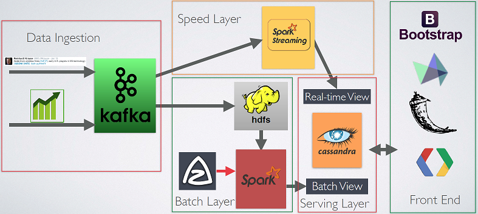

# Big Data Capstone Project

- [Big Data Capstone Project](#big-data-capstone-project)
  - [1. Mô tả bài toán](#1-mô-tả-bài-toán)
  - [2. Mục tiêu và phạm vi của đề tài](#2-mục-tiêu-và-phạm-vi-của-đề-tài)
  - [3. Mô hình luồng dự án](#3-mô-hình-luồng-dự-án)
- [Các bước thực hiện](#các-bước-thực-hiện)
  - [Tạo luồng crawl top 100 coin từ Coingeko](#tạo-luồng-crawl-top-100-coin-từ-coingeko)
  - [Lấy dữ liệu từ](#lấy-dữ-liệu-từ)
  - [Tạo giao diện phân tích cho trang](#tạo-giao-diện-phân-tích-cho-trang)
  - [How to use](#how-to-use)
    - [Cassandra](#cassandra)

## 1. Mô tả bài toán

Trong thị trường tiền số tiền số, sự biến động lớn của thị trường cũng như từng loại tài sản trong thị trường trở thành rủi ro rất lớn với nhà đầu tư. Những biến động tốt có xấu có có thể được tạo ra bằng những nguồn tin trên mạng xã hội. Bất cứ khi nào xuất hiện những thông tin bất lợi cho tài sản thì gần như ngay lập tức số lượng thông tin được phổ biến trên mạng xã hội tăng lên nhanh chóng, từ đó, tạo một phản ứng tiêu cực của cộng đồng lên loại tài sản đó. Do đó, cần thiết một công cụ theo dõi những thông tin trending về các loại tài sản số này trên các nền tảng mạng xã hội, đặc biệt Twitter nơi các trang mạng xã hội thông tin chính thức của nhiều nền tảng tiền kĩ thuật số. Công cụ này có thể giúp người dùng biết được những tài sản số nào đang được quan tâm nhiều nhất trên mạng xã hội trong một khoảng thời gian nhất định và mức độ phản hồi của nó như thế nào của cộng đồng.

## 2. Mục tiêu và phạm vi của đề tài
Thông qua khảo sát, mục tiêu của đề tài, nhóm mong muốn tạo ra công cụ đưa ra cái nhìn tổng quan cho người dùng về các luồng thông tin của mạng xã hội một cách tốt nhất. Bài toán nhóm đặt ra có nhiệm vụ chính sau: 

Thu thập dữ liệu những tài sản số có giá trị tốt lắm trong top 100 coin hiện tại thông qua API của các chuyên trang phân tích như Coingecko, ngoài ra thu thập dữ liệu về giá của các loại tài sản trên sàn.

Thu thập dữ liệu từ các Tweet với hashtag liên quan trực tiếp tới từng loại tài sản ví dụ như #FTM, #SOL, #LUNC, … thường được thêm vào bài viết liên quan tới loại tài sản đó cũng như các hashtag liên quan tới tài sản số như #Web3. Ngoài thông tin thu thập được, nhóm mong muốn đưa thêm vào tính năng phân tích semantic dữ liệu văn bản của các tweet bằng tiếng Anh để hiểu tweet đang đánh giá tích cực hoặc tiêu cực về loại tài sản này.
Tạo phân tích dựa trên dữ liệu thu thập được từ dữ liệu trending về thông tin tweet của loại tài sản trên mạng xã hội cũng như giá biến động của tài sản

## 3. Mô hình luồng dự án
Mô hình luồng dự án sẽ dựa trên kiến trúc Lambda (&#955;) với các tầng xử lý dữ liệu khác nhau  được trình bày trong sơ đồ dưới

# Các bước thực hiện

## Tạo luồng crawl top 100 coin từ Coingeko
Đầu tiên nghiên cứu các API liên quan đến lấy dữ liệu từ Coingeko về tài sản top 100 theo tổng giá trị. 

## Lấy dữ liệu từ 
## Tạo giao diện phân tích cho trang

## How to use

- `docker-compose -p lambda up`
- Wait all services be up and running, then...
- `./project-orchestrate.sh`
- Run realtime job `docker exec spark-master /spark/bin/spark-submit --class com.apssouza.iot.streaming.StreamingProcessor  --master spark://localhost:7077 /opt/spark-data/iot-spark-processor-1.0.0.jar`
- Access the Spark cluster <http://localhost:8080>
- Run the twitter producer `java -jar iot-kafka-producer/target/iot-kafka-producer-1.0.0.jar`

### Cassandra

- Log in `docker exec -it cassandra-iot cqlsh --username cassandra --password cassandra`
- Acess Tweet Keyspace "USE tweets_info;" và xem data trong bảng total_tweets_per_hashtag bằng câu lệnh "SELECT * FROM tweets_info.total_tweets_per_hashtag;".
- - Nhớ làm các bước trên trước thì mới có dữ liệu trong bảng
