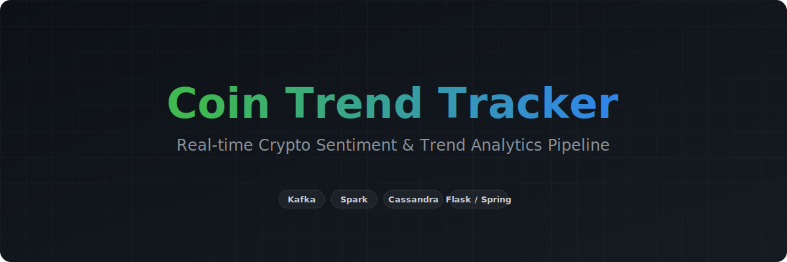
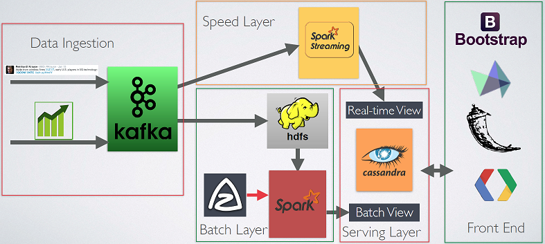

<div align="center">
  
</div>

<br/>

**Coin Trend Tracker** là một công cụ phân tích Big Data thời gian thực. Hệ thống thu thập, tổng hợp, và phân tích cảm xúc (sentiment) của cộng đồng về các tài sản kỹ thuật số (Cryptocurrency) trên mạng xã hội Twitter, giúp nhà đầu tư nắm bắt nhanh chóng rủi ro hoặc cơ hội khi có tin tức lớn lan truyền.

---

## ⚡ Kiến trúc hệ thống (Data Pipeline)

Hệ thống được thiết kế theo kiến trúc Lambda (λ) để đáp ứng cả xử lý luồng (Real-time) và lô (Batch).

<div align="center">
  
</div>
<br/>

- **Thu thập dữ liệu (Ingestion)**:
  - **CoinGecko Crawler**: Lấy dữ liệu giá và danh sách Top 100 coin.
  - **Twitter API (Kafka Producer)**: Streaming các dòng tweet theo hashtag (ví dụ: `#BTC`, `#ETH`).
- **Xử lý tính toán (Processing)**: 
  - **Spark Streaming (Real-time)**: Tính toán xu hướng hashtag, tổng hợp lượt tương tác (Like, Retweet, Reply) và phân tích cảm xúc (Positive, Negative, Neutral).
  - **Spark Batch**: Xử lý dữ liệu định kỳ lưu trên HDFS.
- **Lưu trữ (Storage)**:
  - **Cassandra**: Lưu trữ dữ liệu phân tích đã qua xử lý để truy vấn trực tiếp.
  - **HDFS**: Lưu raw data và thông tin checkpoint cho Spark.
- **Hiển thị (Visualization)**:
  - **Flask / Spring Boot**: Backend cung cấp API và Dashboard hiển thị biểu đồ trực quan.

---

## 🚀 Hướng dẫn cài đặt & sử dụng

Yêu cầu hệ thống: **Docker**, **Docker Compose**, **Java 11**, **Maven**, **Python 3**. Đừng quên cấu hình `BEARER_TOKEN` trong file `.env` trước khi khởi chạy.

### 1. Khởi động hạ tầng Docker
Hệ thống sử dụng Docker Compose để tự động triển khai Kafka, Zookeeper, Cassandra, Spark Master/Worker, và Hadoop HDFS.
```bash
docker-compose up -d
```
> [!NOTE]
> Vui lòng đợi vài phút để tất cả các container khởi động hoàn toàn. Network và Volume sẽ được cấp phát tự động.

### 2. Biên dịch mã nguồn (Build Packages)
Sử dụng Maven để đóng gói các thư viện và module xử lý (Kafka Producer & Spark Processor).
```bash
mvn clean package
```

### 3. Thiết lập hệ thống (Provisioning)
Khởi tạo cấu trúc thư mục trên Hadoop HDFS, tạo Kafka Topic, Cassandra Schema, và cài đặt môi trường ảo cho Python:
```bash
./project-orchestrate.sh
```

### 4. Khởi chạy luồng dữ liệu (Data Flow)

**Bật Spark Real-time Processor**
```bash
docker exec spark-master /spark/bin/spark-submit \
  --class com.trinhhungfischer.cointrendy.PipelineProcessor \
  --master spark://localhost:7077 \
  /opt/spark-data/twitter-spark-processor-1.0.0.jar
```
*(Giao diện quản lý Spark Master: http://localhost:8080)*

**Bật Twitter Kafka Producer (Đổ dữ liệu vào)**
```bash
java -jar kafka/twitterProducer/target/twitter-kafka-producer-1.0.0.jar
```

**(Tùy chọn) Chạy Spark Batch Job**
```bash
docker exec spark-master /spark/bin/spark-submit \
  --class com.trinhhungfischer.cointrendy.batch.BatchProcessor \
  --master spark://localhost:7077 \
  /opt/spark-data/twitter-spark-processor-1.0.0.jar
```

### 5. Khởi chạy Web Dashboard (Flask)

Ứng dụng Flask sẽ đọc dữ liệu đã phân tích từ Cassandra và hiển thị biểu đồ.

```bash
# Kích hoạt môi trường ảo Python
source .venv/bin/activate

# Chạy Flask Server
python flask/run.py
```
*(Giao diện sẽ hiển thị tại: `http://localhost:5000`)*

---

## 📊 Truy vấn Dữ liệu (Cassandra)

Dữ liệu phân tích luồng đã được ghi vào Cassandra tại keyspace `tweets_info`.

```bash
# 1. Truy cập vào CQL Shell
docker exec -it cassandra-coin-trendy cqlsh --username cassandra --password cassandra

# 2. Truy vấn dữ liệu thực tế
USE tweets_info;
SELECT * FROM total_tweets;
```
